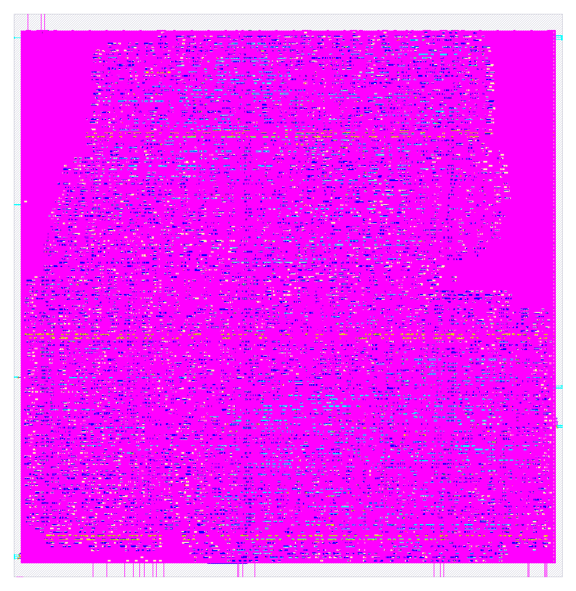

# tiny-gpu — sky130 tapeout deliverables

Signoff outputs from hardening `tt_um_tiny_gpu` (the TinyTapeout wrapper) through
the open-source [LibreLane](https://github.com/librelane/librelane) RTL-to-GDS
flow on the SkyWater **sky130A** PDK (`sky130_fd_sc_hd` standard cells).

Configuration: 1 core / 2 threads / 2 data channels, ALU divider removed
(`NO_DIV`), 100 ns (10 MHz) target clock.

## Files

| File | Description |
|------|-------------|
| `tt_um_tiny_gpu.gds`   | Final GDSII layout (the manufacturable database) |
| `tt_um_tiny_gpu.png`   | Rendered top-down view of the die |
| `tt_um_tiny_gpu.nl.v`  | Gate-level netlist (post-synthesis, mapped to sky130 cells) |
| `metrics.json` / `.csv`| Full signoff metrics |

## Signoff summary

| Metric | Value |
|--------|-------|
| Die area | 177,166 µm² (≈ 421 × 421 µm) |
| Std-cell utilization | 54 % |
| Magic DRC errors | 0 |
| KLayout DRC errors | 0 |
| LVS errors | 0 |
| Antenna violations | 0 |
| TinyTapeout tiles | 6×2 |

Regenerate with `librelane --pdk sky130A --scl sky130_fd_sc_hd config.json`
from the build directory (see `../config.json`). The full LibreLane run tree
(`runs/`, ~800 MB) is not checked in — only these final deliverables are.
